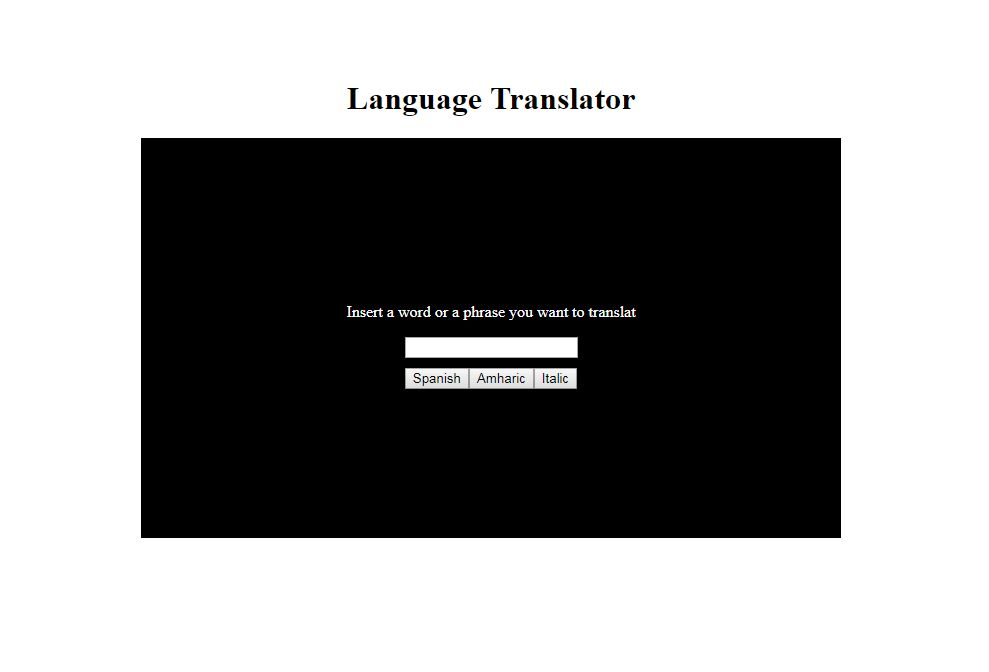

## Translator
This was an individual exercise to build a page which translat a word into 3 different languages.

I have practiced more of JavaScript with this project. 


## Screenshots




## How to run this project:

* Use nmp to install htpp-server:

```sh

npm install -g http-server

```
* Run the server:

```sh

hs -p 9999

```

* Open Chrome and navigate to:

```

localhost:9999

```
